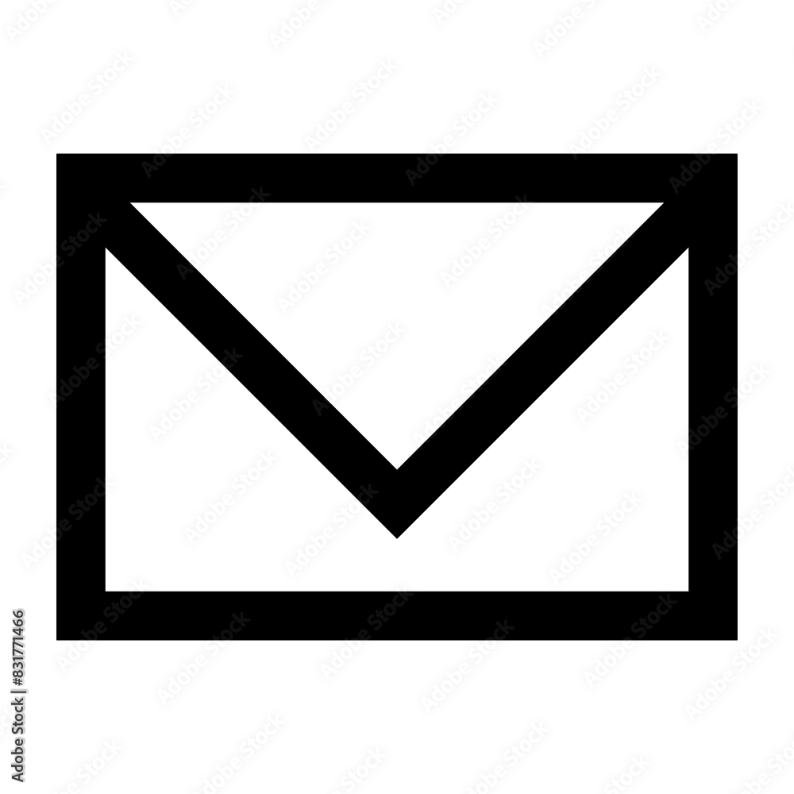

#  Ahsan Riaz Data/Business Analyst  
### TECHNICAL SKILLS

---

  
<strong>Languages & Tools</strong>

  <ul>
    <li><strong>Programming Languages:</strong>
      <ul>
        <li>Python</li>
        <li>C++</li>
        <li>SQL</li>
      </ul>
    </li>
    <li><strong>Tools & Platforms:</strong>
      <ul>
        <li>Spark</li>
        <li>Google Cloud Platform (GCP)</li>
        <li>Tableau</li>
        <li>Teradata</li>
        <li>MicroStrategy</li>
        <li>Grafana</li>
        <li>JIRA, Confluence</li>
      </ul>
    </li>
  </ul>

  
<strong>Frameworks & Libraries</strong>

  <ul>
    <li>NumPy</li>
    <li>Pandas</li>
    <li>Matplotlib</li>
    <li>XGBoost</li>
    <li>Scikit-learn</li>
    <li>PyTorch</li>
    <li>PyMC</li>
    <li>TensorFlow</li>
  </ul>

  
<strong>Core Competencies</strong>

  <ul>
    <li>Data Mining</li>
    <li>Visualization</li>
    <li>Machine Learning</li>
    <li>Deep Learning</li>
    <li>Database Management</li>
    <li>Distributed Computing</li>
  </ul>

 

### EDUCATION

---
**Stevens Institute of Technology**  
***New Jersey Hoboken, USA* &nbsp; **  
**M.S. Business Intelligence and Analytics** _May 2026_

  
<em>Relevant Coursework</em>

  <ul>
    <li>Machine Learning</li>
    <li>Data Sciencee</li>
    <li>Big Data Mining</li>
    <li>Natural Language Processing</li>
    <li>Energy Efficient Deep Learning</li>
  </ul>

 

**Institute of Business Administration Karachi**  
***Karachi, Pakistan* &nbsp; **  
**B.S. Economics and Mathematics** _May 2021_
 

### WORK EXPERIENCE

---
**Shell (Oil and Gas)** | Karachi, PK &nbsp;   
**Business Analyst** | 2023 – 2024  
- Analyzed over 50,000 historical sales orders in Python to identify trends and peak demand periods for various regions, leading to a 12% improvement in inventory accuracy and a 10% reduction in stockouts.
- Categorized 300+ gas stations based on demand patterns using Tableau to tailor distribution strategy, resulting in a 10% reduction in logistics costs while maintaining a 95% on-time delivery rate.
- Coordinated the distribution of 4 million liters of fuel across 300+ gas stations by efficiently scheduling 40 trucks, resulting in a 15% increase in delivery efficiency and a 10% reduction in transportation costs.
- Analyzed lead time and on-time delivery metrics in Power BI, implementing process improvements that boosted the customer satisfaction index by 20% and decreased lead times by 15%.
- **Tools:** Python, Tableau, Power BI, Excel
- **Competencies:** Demand Forecasting, Supply Chain Optimization, KPI Reporting, Logistics Management, Stakeholder Communication
 

**Daraz Alibaba Group** | Karachi, PK &nbsp;   
**Business Analyst** | 2022 – 2023  
- Used Excel Power Query to process and analyze daily data from 1.5 million packages, generating performance reports that enhanced operational visibility and efficiency.
- Managed a $3.5 million annual budget, ensuring optimal resource allocation and achieving significant cost savings through regular financial reviews and analyses.
- Developed interactive dashboards and visualizations in Tableau to monitor performance metrics, leading to a 15% increase in operational efficiency and a 10% reduction in costs.
- Established daily communication with transport partners, achieving a 98% on-time delivery rate and significantly improving operational coordination.
- **Tools:** Excel Power Query, Tableau, SQL
- **Competencies:** Financial Analysis, Data Visualization, Performance Monitoring, Cost Optimization, Vendor Coordination
 

**Dubai Ports World** | Karachi, PK &nbsp;   
**Management Trainee - Supply Chain** | 2021 – 2022  
- Proposed and executed a truck routing plan that reduced fuel consumption by 20%, lowered carbon emissions by 2.77 tons annually, and resulted in cost savings of 1.4 million PKR.
- Led a Lean project on “Truck Turnaround Time” (TTT) reduction by identifying bottlenecks and implementing process improvements, achieving a 12% reduction in TTT.
- Collaborated with cross-functional teams to optimize logistics operations, improve service levels, and enhance overall supply chain efficiency.
- **Tools:** Excel, SQL, Tableau
- **Competencies:** Process Improvement, Lean Six Sigma, Transportation Analytics, Supply Chain Management, Sustainability Reporting
 

### PROJECTS

---
#### Data Warehouse and Analytics Project [GitHub](https://github.com/Ahsan-Awan123/sql-datawarehouse-project)

This project demonstrates a comprehensive data warehouse and analytics solution, from building a data warehouse to generating a actionble insights design as a portfolio project, highlights industry best practices in data engineering and analytics.
  

#### Sales-Data-Analysis (Interactive Dashboard creation using Tableau) [GitHub](https://github.com/Ahsan-Awan123/Data-Analysis-Dashbaord)

This interactive Tableau dashboard provides a comprehensive view of sales, profit, and quantity performance with a strong focus on year-over-year comparison and trend analysis

-How are total sales trending over time, and how do they compare year-over-year?
-Is revenue growth translating into profit growth, or is margin being compressed?
-Which periods show above-average vs below-average performance in sales and profit?
-Is growth driven by higher sales volume (quantity) or by pricing effects?
  

### CONTACT

---

Feel free to reach out to me through the following channels:  
**** [ahsen.riazk@gmail.com](mailto:ahsen.riazk@gmail.com)  
**** [https://www.linkedin.com/in/ahsan-riaz-321527182/](https://www.linkedin.com/in/ahsan-riaz-321527182/)
